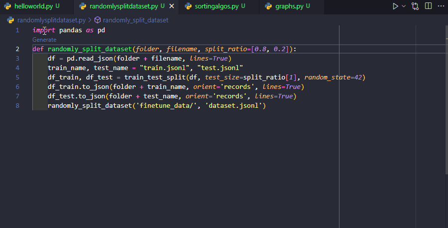

# Doxide

> 🤖 Automate code documentation with OpenAI-Codex

Table of Contents

- [Doxide](#doxide)
  - [✨ Features](#-features)
    - [Docstrings](#docstrings)
    - [Statement/Block Comments [TODO]](#statementblock-comments-todo)
    - [File Headers [TODO]](#file-headers-todo)
  - [🔨 Installation and Setup [TODO]](#-installation-and-setup-todo)
    - [OpenAI API Key](#openai-api-key)
  - [⚙️ Customisation & Extension Settings](#️-customisation--extension-settings)

## ✨ Features
### Docstrings
* Generate
  * 
* Configure

### Statement/Block Comments [TODO]
* Generate
* Alternatives
* Configure

### File Headers [TODO]
* Generate
* Alternatives
* Configure
* with Table of Contents for bar comments - and 'bring me to line'

## 🔨 Installation and Setup [TODO]
### OpenAI API Key
* To use this extension, you must have an OpenAI API Key

## ⚙️ Customisation & Extension Settings
* 

